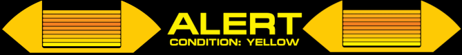

<link rel="stylesheet" href="star.css">


# Chapter 2: Variables and Mutability: 
## Assigning Crew and Adapting Systems
 

Just as a starship relies on assigning crew members to specific stations and adapting its systems to various situations, our Rust programs rely on variables to store and manipulate data. In this chapter, we'll explore how to declare variables and understand Rust's approach to mutability – the ability of a variable's value to change.

###  Declaring Variables with `let`: Assigning Crew to Stations

In Rust, we use the `let` keyword to declare a variable. Think of this as assigning a specific crew member to a particular station on the starship. Once assigned, that crew member (the value) generally stays at their post unless explicitly reassigned.

Here's a simple example:

```rust, editable
fn main() {
    let starship_name = "USS Enterprise";
    println!("The name of the flagship is: {}", starship_name);
}
```
This is also valid:

```rust, editable
fn main() {
    let starship_name = "USS Enterprise";
    println!("The name of the flagship is: {starship_name}");
}
```


In this code, `let` indicates the start of a variable declaration. `starship_name` is the identifier we've chosen for our variable, much like the designation of a starship. The `=` operator assigns the string literal "USS Enterprise" to this variable. Finally, `println!` is a macro that prints the value of `starship_name` to the console. The `{}` is a placeholder that gets replaced by the value of the variable provided after the comma.

###  Type Inference: The Computer Knows Best

In many cases, Rust is smart enough to figure out the type of data you're assigning to a variable. This is called type inference. In our previous example, Rust can infer that `"USS Enterprise"` is a string.

However, you can also explicitly specify the type of a variable during declaration:
Rust

```rust, editable
fn main() {
    let warp_factor: f64 = 9.975;
    println!("Engaging at warp factor: {}", warp_factor);
}
```

Here, : `f64` after the variable name specifies that `warp_factor` will hold a 64-bit floating-point number. Specifying the type can be useful for clarity or when Rust can't infer the type on its own.

###  Immutability by Default: Starfleet Directives

One of Rust's core principles is immutability by default. This means that once you assign a value to a variable using `let`, you cannot change that value later in your program, unless you explicitly allow it. Think of this as a Starfleet directive – once a system is set, it generally remains that way for stability and predictability.

Let's see what happens if we try to change the value of starship_name from our first example:


```rust, editable
fn main() {
    let starship_name = "USS Enterprise";
    // starship_name = "USS Voyager"; // This will cause a compile-time error!
    println!("The name of the flagship is: {}", starship_name);
}
```

If you uncomment the line `starship_name = "USS Voyager"`; and try to compile this code, the Rust compiler will issue an error message. This error tells you that you cannot assign a new value to an immutable variable. This design choice in Rust helps prevent unexpected side effects and makes your code easier to reason about.


###  Making Variables Mutable with mut:  Reassigning Crew as Needed

Of course, there are times when you need a variable's value to change. In such cases, you can use the mut keyword when declaring the variable. This is like getting authorization to reassign a crew member to a different station when the situation demands it.

Here's how you can declare a mutable variable:


```rust, editable
fn main() {
    let mut shield_strength = 50;
    println!("Initial shield strength: {}", shield_strength);

    shield_strength = 80;
    println!("Shield strength after reinforcement: {}", shield_strength);
}
```

In this example, let mut indicates that `shield_strength` is a mutable variable. We first assign it the integer value 50. Later in the main function, we can reassign it to the value 80 without any compiler errors. Remember to use mutability judiciously, favoring immutability for safer and more predictable code.

###  Shadowing: Temporarily Redefining a Designation

Rust allows you to declare a new variable with the same name as a previous variable. This is called shadowing. The new variable "shadows" the previous 1  one within its scope. Think of this as temporarily redefining a designation for a specific task.  


Here's an example:


```rust, editable
fn main() {
    let photon_torpedoes = 50;
    println!("Initial torpedo count: {}", photon_torpedoes);

    let photon_torpedoes = photon_torpedoes - 2; // Shadowing the previous variable
    println!("Torpedo count after firing: {}", photon_torpedoes);

    let photon_torpedoes = "Recharging"; // Shadowing with a different type!
    println!("Torpedo status: {}", photon_torpedoes);
}
```

In this code, we first declare `photon_torpedoes` and initialize it to 50. Then, we use `let photon_torpedoes` again to declare a new variable with the same name. This new `photon_torpedoes` takes the value of the original `photon_torpedoes` minus 2. The first `photon_torpedoes` is now shadowed. Interestingly, we can even shadow a variable with a different type, as demonstrated in the last declaration where `photon_torpedoes` is reassigned to the string "Recharging". Shadowing is distinct from mutability; it creates a new variable rather than modifying an existing one.

<div class="warning-block">
  
  <p class="warning-text">
    Be careful with shadowing, reassigning variables to different types may make the code harder to read.  Also it obsfucates the intention of mutability.
  </p>
</div>


###  Constants: Immutable Laws of the Universe

Besides regular variables, Rust also has constants. Constants are values that are bound to a name and are not allowed to be mutated. Unlike variables declared with let, you must annotate the type of a constant. Constants are declared using the `const` keyword. Think of these as the fundamental, unchanging laws of the universe within your program.
Rust

```rust, editable
const SPEED_OF_LIGHT: u32 = 299792458; // Type annotation is required
//const SPEED_OF_LIGHT:  i32 = 2;  //This will fail as constants can only be decalred once withing their scope, no shadowing.
fn main() {
    println!("The speed of light is {} meters per second.", SPEED_OF_LIGHT);
}
```

Here, const SPEED_OF_LIGHT: u32 = 299,792,458; declares a constant named SPEED_OF_LIGHT of type u32 (an unsigned 32-bit integer) and assigns it the value 299,792,458. Constants are typically declared in uppercase with underscores between words for readability and are often used for values that will never change throughout the program's execution.


<details class="discovery-details">
  <summary class="discovery-summary">
    
    
    Constant Versus Static
  </summary>
  <div class="discovery-content">
The difference between static and const variables in Rust. While both are used to declare global-like variables with a fixed value (at least in the case of const), there are key distinctions:

const Variables:

    Always Immutable: const variables are inherently immutable and cannot be declared as mutable using mut. Their value is fixed at compile time.
    Compile-Time Evaluation: The value assigned to a const variable must be a constant expression that can be evaluated at compile time. This means you can't assign the result of a function call (unless it's a const fn) or any value that isn't known during compilation.
    No Fixed Memory Location (Often Inlined): The compiler might choose to inline the value of a const variable directly at each place it's used in the code. This means it doesn't necessarily have a single, fixed memory location in the final executable.
    Lifetime: const variables don't have a single, specific memory location, so the concept of a fixed lifetime is less relevant. Their "lifetime" is essentially the scope where they are used.
    Use Cases: Primarily used for defining symbolic constants whose values are known at compile time and will never change throughout the program's execution. Examples include mathematical constants (like PI), configuration values, or fixed string literals.

static Variables:

    Potentially Mutable (but Unsafe): static variables can be declared as mutable using the mut keyword. However, accessing or modifying a mutable static variable is inherently unsafe in Rust and requires an unsafe block. This is because Rust's memory safety guarantees cannot be enforced across global mutable state without explicit opt-in.
    Runtime Initialization (Generally): While static variables can be initialized with constant expressions, they can also be initialized with values computed at runtime (though often they are still initialized at compile time).
    Fixed Memory Location: static variables have a fixed memory location in the program's static memory. This means there is only one instance of the static variable throughout the entire program's lifetime.
    'static Lifetime: static variables have a 'static lifetime, meaning they live for the entire duration of the program.
    Use Cases: Typically used for global variables that need a fixed memory location and a 'static lifetime. This might include things like global counters, shared mutable state (with careful synchronization and unsafe blocks), or pointers to data that lives for the entire program.

Here's a table summarizing the key differences:
| Feature          | `const`                                  | `static`                                      |
| ---------------- | ---------------------------------------- | --------------------------------------------- |
| Mutability       | Always immutable                         | Potentially mutable (requires `unsafe`)       |
| Evaluation       | Compile-time only                        | Generally compile-time, but can be runtime    |
| Memory Location  | Often inlined, no fixed location        | Fixed location in static memory             |
| Lifetime         | Scope-based                             | `'static` (program lifetime)                 |
| `mut` Keyword    | Not allowed                             | Allowed (but requires `unsafe` for access)   |
| Use Cases        | Symbolic constants, compile-time values | Global variables, shared mutable state (unsafe) |

In essence:

    Use const for values that are truly constant and known at compile time. The compiler has more freedom to optimize const values.
    Use static for global variables that need a fixed memory address and a 'static lifetime. 

Be very cautious when using mutable static variables due to the inherent unsafety.


```rust, editable
const STANDARD_WARP_FACTOR_LIMIT: u8 = 9; // A constant representing the standard warp factor limit

static CURRENT_STARBASE: &str = "Earth Spacedock"; // A static variable for the current starbase

static mut ACTIVE_SHIELDS: bool = false; // A mutable static variable indicating if shields are active (requires unsafe)

fn main() {
    println!("The standard warp factor limit according to Starfleet regulations is: Warp {}", STANDARD_WARP_FACTOR_LIMIT);
    println!("The fleet is currently operating near: {}", CURRENT_STARBASE);

    println!("Are shields active? {}", is_shields_active());

    unsafe {
        ACTIVE_SHIELDS = true; // Engaging shields globally (requires unsafe block)
    }

    println!("Are shields active now? {}", is_shields_active());
}

fn is_shields_active() -> bool {
    unsafe {
        ACTIVE_SHIELDS // Accessing a mutable static variable requires an unsafe block
    }
}
```

**Explanation:**

`const STANDARD_WARP_FACTOR_LIMIT: u8 = 9;:` Here, we define a const variable named `STANDARD_WARP_FACTOR_LIMIT`. Its value, 9, is known at compile time and will never change during the program's execution. This is like a fixed regulation in Starfleet.

`static CURRENT_STARBASE: &str = "Earth Spacedock";`: This declares a static variable named `CURRENT_STARBAS`E and initializes it with the string "Earth Spacedock". This variable has a fixed memory location and a 'static lifetime, meaning it exists for the entire duration of the program. It represents a global piece of information that might be accessed from different parts of the codebase.

`static mut ACTIVE_SHIELDS: bool = false;`: This declares a mutable static variable named `ACTIVE_SHIELDS`, initialized to false. Because it's mutable, accessing and modifying it requires the use of unsafe blocks. This is because the Rust compiler cannot guarantee memory safety across global mutable state without explicit opt-in. It represents a global state that can change during the program's execution (like the activation of a starship's shields).

main function: We demonstrate accessing both the const and static variables. Notice that accessing the `mutable static ACTIVE_SHIELDS` is done within an unsafe block in both the main function and the `is_shields_active` function.
  </div>
</details>


 


###  Starfleet Analogy Recap

 -   `let`: Assigning a crew member to a station.
 -   Immutability by Default: Starfleet directives ensuring system stability.
 -   `mut`: Getting authorization to reassign a crew member when necessary.
 -   Shadowing: Temporarily redefining a designation for a specific task.
 -   `const`: The fundamental, unchanging laws governing the universe (or your program).
